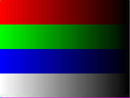
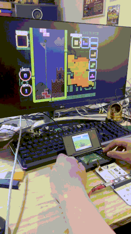
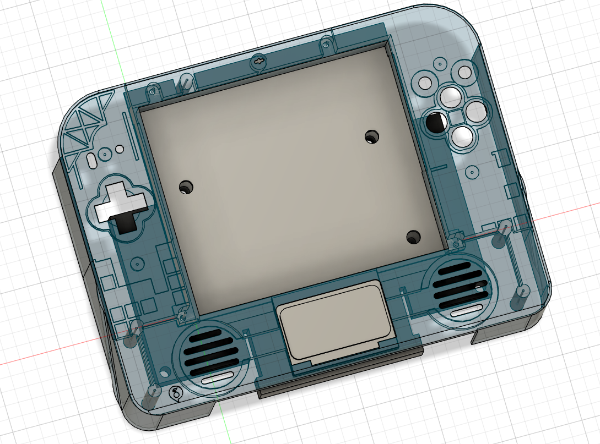

## DS to HDMI converter

Here is an archive project of mine. It takes the raw video signals of the ds and scale up, pixel to pixel to DVI video in 1080p, 720p, etc. using an artix 7 FPGA (Cmod A7), and play both DS and GBA games.

Demotration can be seen at https://youtube.com/shorts/DusmrjSz5Js

Also share the PCB designs and pinout probing done in the ds family systems (LS030.xlsx), for which the DSi XL is electrically compatible and a second PCB and enclosure were desinged. 
The TFP410 TMDS transmitter and logic buffers are not required in most cases.

Some test roms are included. These are particulary coded to indentify the timing of the 5 bit RGB signals without expensive logic analizer, a cheap off-brand usb 8 Channels is enough.

The future plan was to pass the project to a Tang Primer 25K, a cheaper FPGA, or a dedicaded TFP410 Serializer. But never get the time and money to realize them. I share this in case someone had the same vision...
For more on the DVI serialization see: https://github.com/projf/display_controller

The show scale correspont to a x5.

Here is a drawing of the expectated case using a DSi XL screen and a DS Fat motherboard (this model allow easier wiring as both screen data is recived for both displays, only with differing in the clock signal phase)

